## 🏗️ Architecture du Système

### Diagramme de flux (Mermaid)

```mermaid
graph LR
    %% Style definitions
    classDef frontendStyle fill:#4a5bdc,stroke:#3d4bb8,stroke-width:3px,color:#fff,font-size:14px
    classDef backendStyle fill:#4a5bdc,stroke:#3d4bb8,stroke-width:3px,color:#fff,font-size:14px
    classDef processingStyle fill:#f59e42,stroke:#d98636,stroke-width:3px,color:#fff,font-size:14px
    classDef aiStyle fill:#48bb78,stroke:#3da565,stroke-width:3px,color:#fff,font-size:14px
    classDef analysisStyle fill:#f59e42,stroke:#d98636,stroke-width:3px,color:#fff,font-size:14px
    classDef detectionStyle fill:#e53e3e,stroke:#c53030,stroke-width:3px,color:#fff,font-size:14px
    classDef resultStyle fill:#4a5bdc,stroke:#3d4bb8,stroke-width:3px,color:#fff,font-size:14px
    
    %% Nodes
    A["💻 Interface Web Frontend<br/>─────────────────<br/>Interface HTML statique - Upload vidéo<br/>HTML/CSS3 | JavaScript"]
    B["⚡ API Backend FastAPI<br/>─────────────────<br/>Serveur FastAPI - Découpage vidéo en frames<br/>FastAPI | Python | OpenCV"]
    C["🎬 Extraction de Frames<br/>─────────────────<br/>Découpage automatique: Vidéo → Images<br/>OpenCV | FFmpeg"]
    D["🤖 Modèles YOLOv8-seg<br/>─────────────────<br/>3 Modèles: Personnes + Véhicules | Routes + Passages piétons<br/>YOLOv8-seg | PyTorch"]
    E["📊 Analyse de Situation<br/>─────────────────<br/>Classification frame par frame: Position piéton vs passage<br/>Analyse spatiale | Géométrie"]
    F["🚨 Résultats & Détection de Fraude<br/>─────────────────<br/>✅ Correct | ⚠️ DANGER: Hors passage | 🛣️ Route vide | 🚗 Véhicules<br/>Classification | Scoring"]
    G["📤 Affichage des Résultats<br/>─────────────────<br/>Images annotées + Classification finale<br/>Visualisation | Rapports"]
    
    %% Connections
    A -->|Upload Vidéo| B
    B -->|Traitement| C
    C -->|Frames extraites| D
    D -->|Détections| E
    E -->|Analyse spatiale| F
    F -->|Résultats| G
    G -->|Affichage| A
    
    %% Apply styles
    class A frontendStyle
    class B backendStyle
    class C processingStyle
    class D aiStyle
    class E analysisStyle
    class F detectionStyle
    class G resultStyle
```



 # 🚦 Urban Fraud Detection - Analyse de Situations Routières

## 📋 Description
Système intelligent d'analyse de situations routières utilisant YOLO pour détecter et classifier les interactions entre piétons, véhicules et infrastructure routière.

## 🎯 Fonctionnalités
- **Détection multi-objets** : Piétons, véhicules, routes, passages piétons
- **Analyse de situations** : Classification automatique des situations de circulation
- **Segmentation avancée** : Utilisation de modèles YOLO spécialisés
- **Interface web** : Visualisation des résultats via interface HTML
- **Analyse de séquences** : Traitement de multiples images pour classification finale

## 🏗️ Architecture
```
├── s.py                    # Script principal d'analyse
├── static/
│   └── index.html         # Interface web
├── api.py                 # API (si applicable)
├── requirements.txt       # Dépendances Python
└── README.md             # Documentation
```

## ⚙️ Installation

### 1. Cloner le repository
```bash
git clone https://github.com/votre-username/urban-fraud-detection.git
cd urban-fraud-detection
```

### 2. Créer un environnement virtuel
```bash
python -m venv venv
source venv/bin/activate  # Linux/Mac
# ou
venv\Scripts\activate     # Windows
```

### 3. Installer les dépendances
```bash
pip install -r requirements.txt
```

### 4. Télécharger les modèles YOLO
```bash
# Les modèles standard seront téléchargés automatiquement
#  Pour les modèles personnalisés, placez-les dans :
 - ./runs/train/exp/road_seg2/weights/best.pt
 - ./runs/train/exp/passage_pieton_seg3/weights/best.pt
```

## 🚀 Utilisation

### Analyse d'images
```bash
python s.py
```

### Configuration
Modifiez la classe `Config` dans `s.py` pour :
- Changer les chemins des modèles
- Ajuster les dossiers d'entrée et de sortie
- Modifier les seuils de détection

### Interface Web
```bash
# Si vous avez une API
python api.py
# Puis ouvrez static/index.html dans votre navigateur
```

## 📊 Résultats
Le système génère :
- **Images annotées** : Visualisation des détections avec masques colorés
- **Analyse de situation** : Classification de chaque image
- **Résumé final** : Classification globale de la séquence

### Classifications possibles :
- ✅ Piéton traverse correctement sur le passage piéton
- ❌ DANGER: Piéton traverse la route hors du passage piéton
- 🟡 Route vide avec passage piéton visible
- 🚗 Route occupée par des véhicules uniquement
- 🟢 Route totalement vide

## 🎨 Légende des couleurs
- 🔴 **Rouge** : Piétons
- 🔵 **Bleu** : Véhicules (voiture, moto, bus, camion)
- 🟢 **Vert** : Routes
- 🟤 **Marron** : Passages piétons
- 🟠 **Orange** : Feux de circulation

## 📁 Structure des données
```
votre-projet/
├── JAAD_frames/           # Images d'entrée (non versionnées)
├── combined_results/      # Résultats (non versionnées)
├── runs/                  # Modèles entraînés (non versionnés)
└── static/               # Interface web
```

## 🔧 Configuration avancée

### Modèles utilisés
- `yolov8s-seg.pt` : Segmentation standard (véhicules, personnes)
- `yolov8s.pt` : Détection avec boîtes englobantes
- Modèles personnalisés pour routes et passages piétons

### Paramètres configurables
- `MIN_PIXELS` : Seuil minimal pour la détection (défaut: 200)
- `SITUATION_THRESHOLDS` : Seuils pour la classification finale
- `COLORS` : Couleurs des masques de segmentation

## 🤝 Contribution
1. Fork le projet
2. Créez une branche feature (`git checkout -b feature/AmazingFeature`)
3. Commit vos changements (`git commit -m 'Add some AmazingFeature'`)
4. Push vers la branche (`git push origin feature/AmazingFeature`)
5. Ouvrez une Pull Request


## 🙏 Remerciements
- [Ultralytics YOLO](https://github.com/ultralytics/ultralytics)
- [OpenCV](https://opencv.org/)

- Dataset JAAD pour les tests


